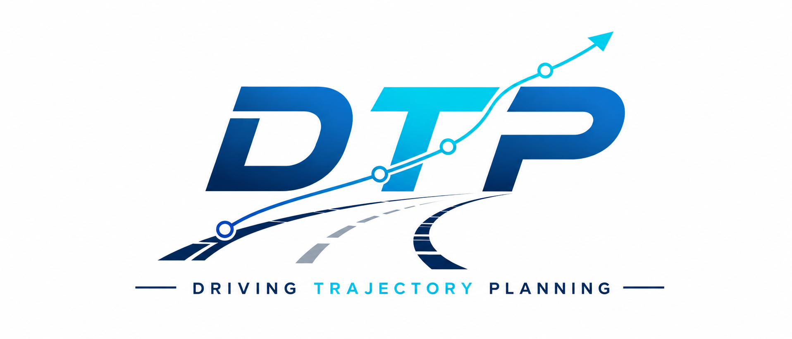
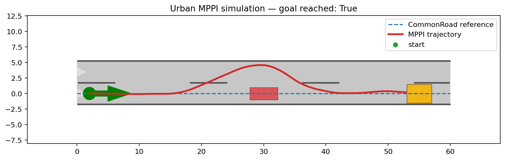

<div align="center">
  
</div>

# DrivingTrajectoryPlanning

[](https://isocpp.org/)
[](https://cmake.org/)
[](https://clang.llvm.org/docs/ClangFormat.html)
[](https://opensource.org/licenses/MIT)


This repository implements a variety of trajectory planning methods for autonomous driving, with a focus on optimization-based approaches. It integrates optimal control planning models with solver interfaces for both OSQP and IPOPT. In addition, the project offers an intuitive visualization window and a streamlined execution pipeline for ease of use.

The repository now has two scenario front ends: **Park** keeps the original
benchmark/optimization workflow, while **Urban** uses CommonRoad with a C++
MPPI planner and Python simulation/rendering.

## File Structure

```text
.
├── CMakeLists.txt
├── LICENSE
├── README.md
├── assets/                    # Images and other static assets
├── data/
│   └── BenchmarkCases/        # Test cases (CSV format)
├── docker/                    # Docker configuration and scripts
├── docs/
│   ├── paper/                 # Related papers
│   └── repo_design/           # Repository design documentation
├── protobuf/                  # Protocol Buffers definitions
├── scripts/                   # Utility scripts (build, run, format)
├── src/
│   ├── collision_check/       # Collision checking logic (GJK, etc.)
│   ├── common/                # Shared utilities and mathematical models
│   ├── config/                # YAML configuration files
│   ├── logger/                # Logging module
│   ├── map/                   # Map representations
│   ├── planner/               # Planners (Hybrid A*, OBCA, RDA, MPPI, etc.)
│   ├── scenarios/
│   │   ├── park/              # Existing parking scenario entry point
│   │   └── urban/             # CommonRoad simulation and rendering
│   ├── solver/                # Solver interfaces and Python bindings
│   ├── test/                  # Unit tests
│   └── utils/                 # Python utilities and visualization
└── third-party/               # External dependencies (EiCOS, glog, pybind11)
```

## Visualization Results
Here are the latest trajectory planning results:

### Urban (MPPI)


### Park (RDA)


# 1. Installation

The project is built and run in an Ubuntu 22.04 container. Install
[Docker](https://www.docker.com/) for Linux or
[Docker Desktop](https://www.docker.com/products/docker-desktop/) for Windows.
Then clone this repository and build the image:

```
git clone --recurse-submodules https://github.com/wenqing-2021/DrivingTrajectoryPlanning.git
cd DrivingTrajectoryPlanning
python3 docker/run_docker.py -b
```

After entering the container, install the native extensions and the Python
packages from `requirements.txt`:

```bash
python3 docker/install_extensions.py -i
```

The extension script installs `requirements.txt` after the native toolchain so
its pinned CommonRoad, Matplotlib, test, and formatting versions take
precedence.

# 2. Run

Enter the container and build the C++ libraries and pybind11 modules:

```
bash scripts/build.sh
```

Run the existing parking scenario:

```bash
bash scripts/run.sh
```

Run the built-in CommonRoad urban scenario:

```bash
bash scripts/run_urban.sh
```

To use another CommonRoad XML file:

```bash
bash scripts/run_urban.sh --scenario path/to/scenario.xml \
  --config src/config/urban_mppi.yaml
```

Urban results (trajectory, control curves, and raw data) are saved under
`solve_results/urban/场景_<solve time>/`, e.g.
`solve_results/urban/场景_20260730-132629/trajectory.png`. Park results are
saved under `solve_results/park/场景_<solve time>/`. See
[`docs/repo_design/SCENARIOS.md`](docs/repo_design/SCENARIOS.md) for the architecture and data flow.
Planner and simulation parameters are stored in
[`src/config/urban_mppi.yaml`](src/config/urban_mppi.yaml).

# 3. Optimization planner

## 3.1 frontend-search
The frontend search stage uses Hybrid A* to generate an initial collision-free path for the backend optimizer.
Core implementation and related modules:
- [Hybrid A* interface](src/planner/hybrid_a_star/hybrid_a_star.h)
- [Reeds-Shepp path utilities](src/planner/hybrid_a_star/rs_path.cpp)

## 3.2 backend-opt
The backend optimization stage refines the frontend path into a smoother and dynamically feasible trajectory.
This project currently supports:
- **OBCA** (IPOPT-based) — [paper](https://arxiv.org/abs/1711.03449)
- **RDA** (OSQP & EiCOS-based) — [paper](<docs/paper/RDA An Accelerated Collision Free Motion Planner for Autonomous Navigation in Cluttered Environments.pdf>)
- **Piecewise-jerk speed optimization** (OSQP-based)
- **MPPI (Model Predictive Path Integral)** for CommonRoad urban scenarios

Core implementation and related modules:
- [Solver configuration](src/config/solver_params.yaml)
- [OBCA solver interface](src/planner/obca/obca_planner.h)
- [RDA solver interface](src/planner/rda/rda_planner.h)
- [Piecewise jerk speed optimizer](src/planner/speed_planner/piece_wise_jerk.cpp)
- [ADMM module](src/planner/admm/admm_planner.cpp)
- [Planner backend dispatch](src/planner/trajectory_planner.cpp)
- [MPPI planner](src/planner/mppi/mppi_planner.cpp)
- [Urban CommonRoad simulation](src/scenarios/urban/simulation.py)

# 4. Acknowledge
This project integrates the RDA planner. We sincerely appreciate the reference implementation from:
- [hanruihua/RDA-planner](https://github.com/hanruihua/RDA-planner)

# 5. Citation
If you find this repository useful in your research or work, please consider citing it:

```bibtex
@misc{DrivingTrajectoryPlanning,
  author = {shijie yuan},
  title = {DrivingTrajectoryPlanning: Trajectory Planning Methods for Autonomous Driving},
  year = {2024},
  publisher = {GitHub},
  journal = {GitHub repository},
  howpublished = {\url{https://github.com/wenqing-2021/DrivingTrajectoryPlanning}}
}
```
