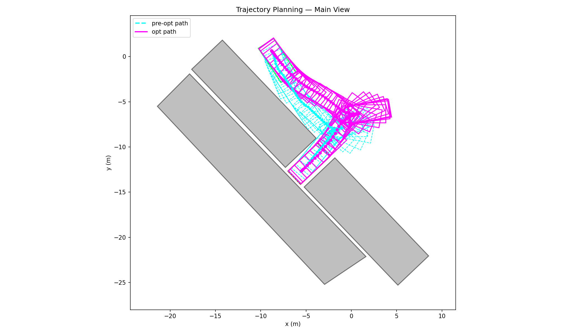
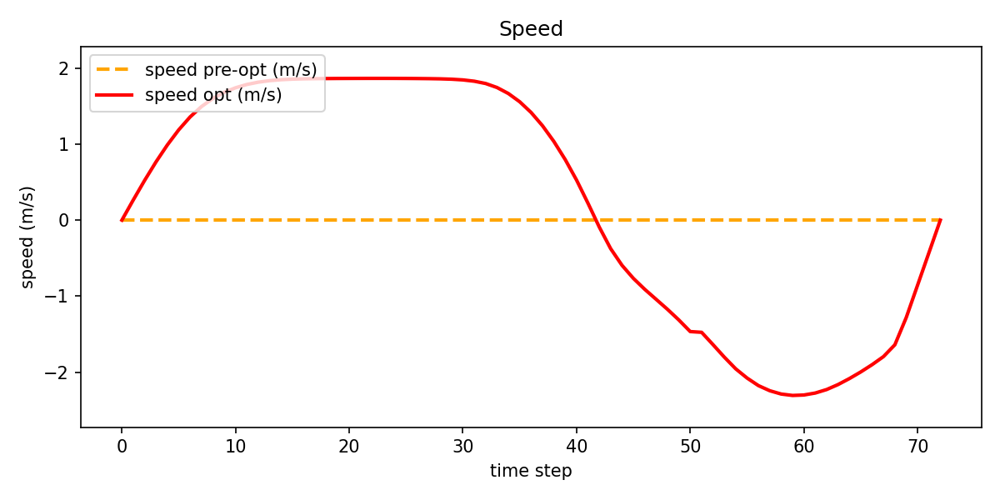
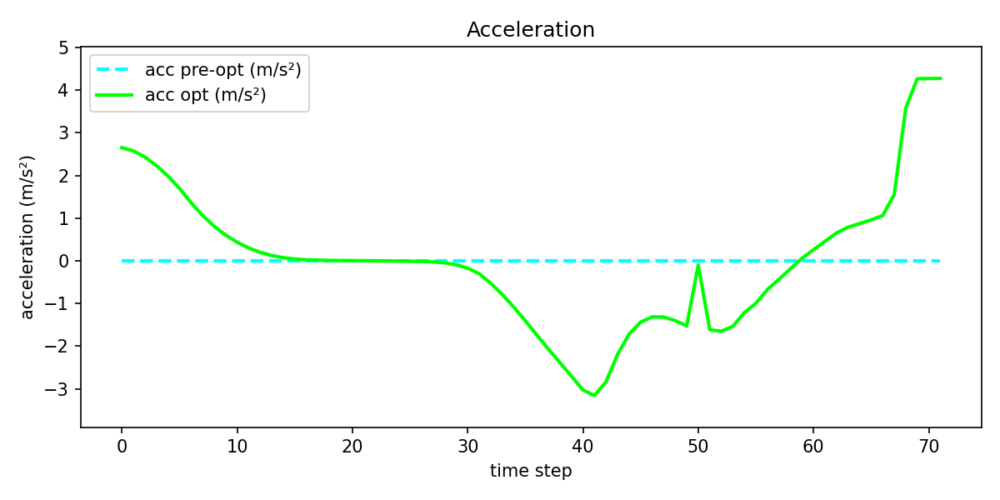
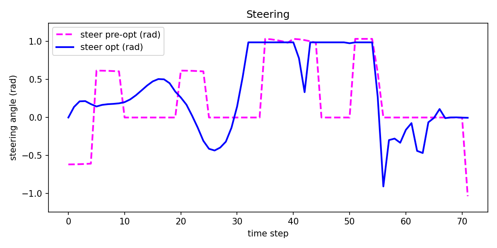

<div align="center">
  
</div>

# DrivingTrajectoryPlanning

[](https://isocpp.org/)
[](https://cmake.org/)
[](https://clang.llvm.org/docs/ClangFormat.html)
[](https://opensource.org/licenses/MIT)
[](https://github.com/wenqing-2021/DrivingTrajectoryPlanning/releases)

This repository implements a variety of trajectory planning methods for autonomous driving, with a focus on optimization-based approaches. It integrates optimal control planning models with solver interfaces for both OSQP and IPOPT. In addition, the project offers an intuitive visualization window and a streamlined execution pipeline for ease of use.

## File Structure

```text
.
├── CMakeLists.txt
├── LICENSE
├── README.md
├── data/
│   └── BenchmarkCases/        # Test cases (CSV format)
├── docker/                    # Docker configuration and scripts
├── docs/                      # Related papers and images
├── protobuf/                  # Protocol Buffers definitions
├── scripts/                   # Utility scripts (build, run, format)
├── src/
│   ├── collision_check/       # Collision checking logic (GJK, etc.)
│   ├── common/                # Shared utilities and mathematical models
│   ├── config/                # YAML configuration files
│   ├── logger/                # Logging module
│   ├── map/                   # Map representations
│   ├── planner/               # Planners (Hybrid A*, OBCA, RDA, Speed Planner)
│   ├── solver/                # Solver interfaces and Python bindings
│   ├── test/                  # Unit tests
│   ├── utils/                 # Python utilities and visualization
│   └── main.py                # Main execution script
└── third-party/               # External dependencies (EiCOS, glog, pybind11)
```

## Visualization Results
Here are some of the latest optimization results using the RDA method:

### Main Trajectory (RDA)


### Speed Profile (RDA)


### Acceleration Profile (RDA)


### Steering Profile (RDA)


# 1. Installation
Before start, you should install [docker](https://www.docker.com/) for Linux or [docker-desktop](https://www.docker.com/products/docker-desktop/) for Windows. After that, clone this repo and run the following command to build images:
```
git clone --recurse-submodules https://github.com/wenqing-2021/DrivingTrajectoryPlanning.git
cd DrivingTrajectoryPlanning
python3 docker/run_docker.py -b
```

# 2. Run
Enter the Container and execute the following commands for start:
```
bash scripts/build.sh
bash scripts/run.sh
```

# 3. Optimization planner

## 3.1 frontend-search
The frontend search stage uses Hybrid A* to generate an initial collision-free path for the backend optimizer.
Core implementation and related modules:
- [Hybrid A* interface](src/planner/hybrid_a_star/hybrid_a_star.h)
- [Reeds-Shepp path utilities](src/planner/hybrid_a_star/rs_path.cpp)

## 3.2 backend-opt
The backend optimization stage refines the frontend path into a smoother and dynamically feasible trajectory.
This project currently supports:
- **OBCA** (IPOPT-based)
- **RDA (Reduced Dual-space ADMM)** (OSQP & EiCOS-based)
- **Piecewise-jerk speed optimization** (OSQP-based)

Core implementation and related modules:
- [Solver configuration](src/config/solver_params.yaml)
- [OBCA solver interface](src/planner/obca/obca_planner.h)
- [RDA solver interface](src/planner/rda/rda_planner.h)
- [Piecewise jerk speed optimizer](src/planner/speed_planner/piece_wise_jerk.cpp)
- [ADMM module](src/planner/admm/admm_planner.cpp)
- [Planner backend dispatch](src/planner/trajectory_planner.cpp)

# 4. Acknowledge
This project integrates the Reduced Dual-space ADMM (RDA) planner. We sincerely appreciate the reference implementation from:
- [hanruihua/RDA-planner](https://github.com/hanruihua/RDA-planner)

# 5. Citation
If you find this repository useful in your research or work, please consider citing it:

```bibtex
@misc{DrivingTrajectoryPlanning,
  author = {shijie yuan},
  title = {DrivingTrajectoryPlanning: Trajectory Planning Methods for Autonomous Driving},
  year = {2024},
  publisher = {GitHub},
  journal = {GitHub repository},
  howpublished = {\url{https://github.com/wenqing-2021/DrivingTrajectoryPlanning}}
}
```