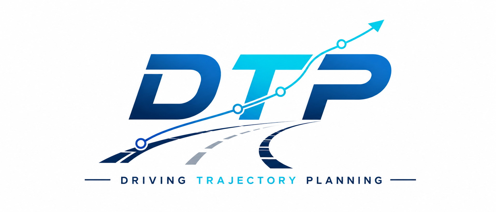
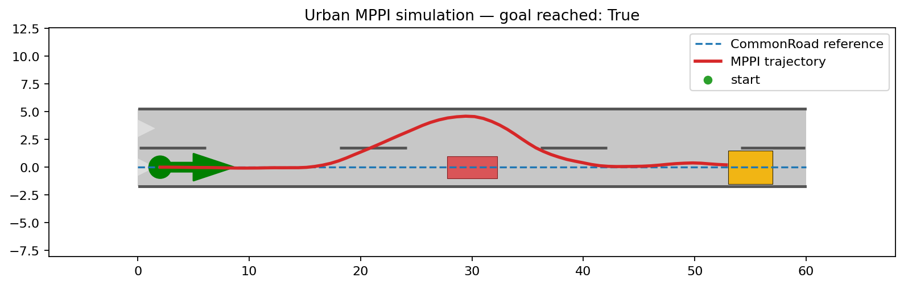
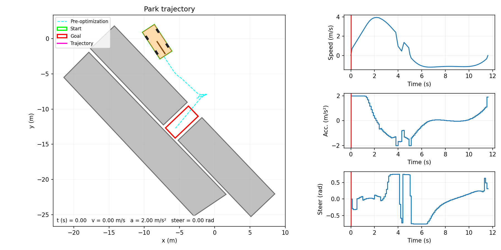
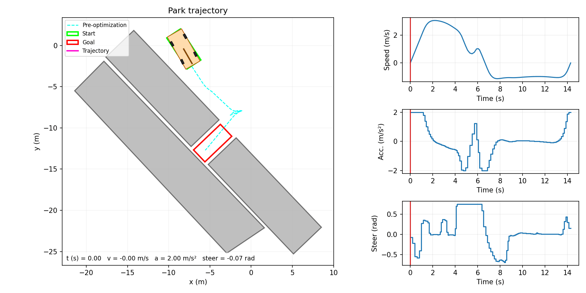
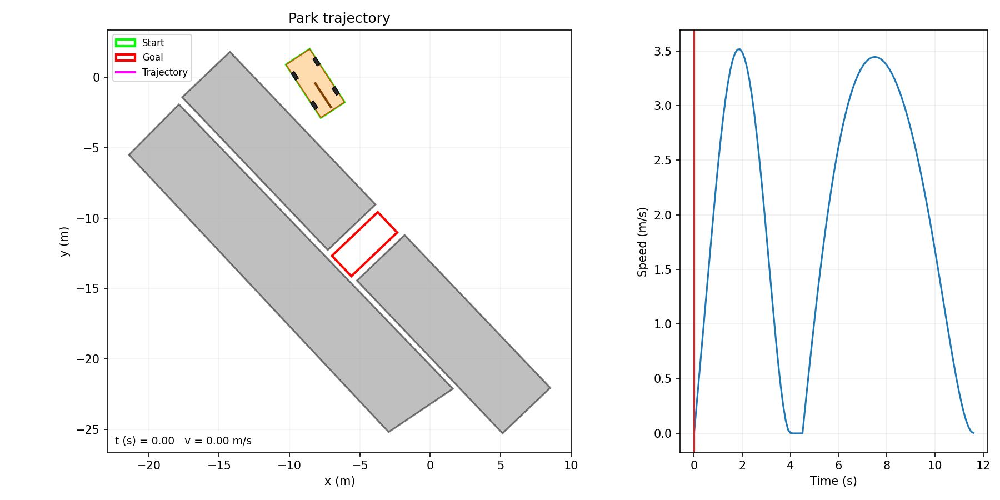
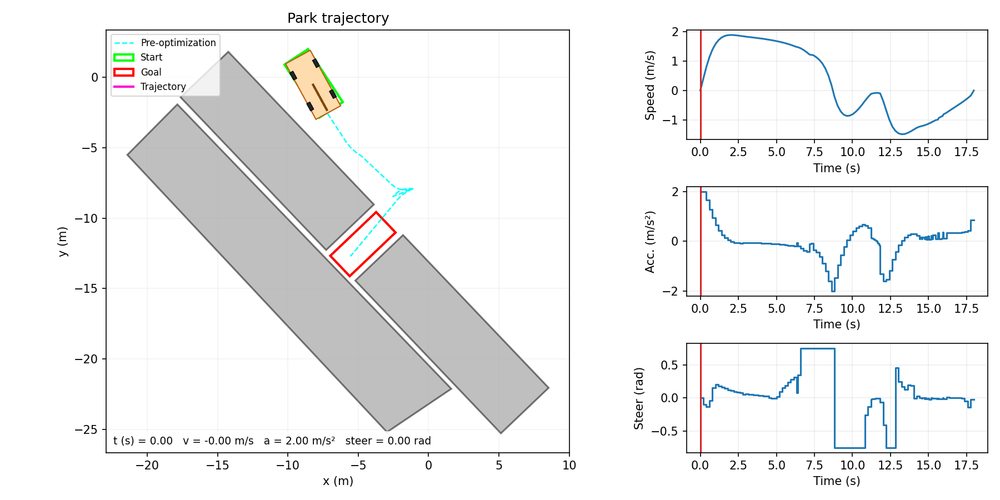

<div align="center">
  
</div>

# DrivingTrajectoryPlanning

[](https://isocpp.org/)
[](https://www.python.org/)
[](https://cmake.org/)
[](https://clang.llvm.org/docs/ClangFormat.html)
[](https://opensource.org/licenses/MIT)
[](https://github.com/wenqing-2021/DrivingTrajectoryPlanning)


This repository implements a variety of trajectory planning methods for autonomous driving, with a focus on optimization-based approaches. It integrates optimal control planning models with solver interfaces for both OSQP and IPOPT. In addition, the project offers an intuitive visualization window and a streamlined execution pipeline for ease of use.

The repository now has two scenario front ends: **Park** keeps the original
benchmark/optimization workflow, while **Urban** uses CommonRoad with a C++
MPPI planner and Python simulation/rendering.

## File Structure

```text
.
├── CMakeLists.txt
├── LICENSE
├── README.md
├── assets/                    # Images and other static assets
├── data/
│   └── BenchmarkCases/        # Test cases (CSV format)
├── conanfile.py               # C++ dependency manifest
├── protobuf/                  # Protocol Buffers definitions
├── scripts/                   # Utility scripts (build, run, format)
├── src/
│   ├── collision_check/       # Collision checking logic (GJK, etc.)
│   ├── common/                # Shared utilities and mathematical models
│   ├── config/                # YAML configuration files
│   ├── logger/                # Logging module
│   ├── map/                   # Map representations
│   ├── planner/               # Planners (Hybrid A*, OBCA, RDA, MPPI, etc.)
│   ├── scenarios/
│   │   ├── park/              # Existing parking scenario entry point
│   │   └── urban/             # CommonRoad simulation and rendering
│   ├── solver/                # Solver interfaces and Python bindings
│   ├── test/                  # Unit tests
│   └── utils/                 # Python utilities and visualization
├── pyproject.toml             # Python dependencies and tool configuration
└── third-party/               # EiCOS and optional local Coin-HSL archive
```

# 1. Installation

The supported environment is Ubuntu 22.04 or a compatible Debian-based Linux
host. Install [uv](https://docs.astral.sh/uv/getting-started/installation/), clone the
repository with its EiCOS submodule, then run the one-command setup:

```
git clone --recurse-submodules <repository-url>
cd DrivingTrajectoryPlanning
bash scripts/setup.sh
```

To install the recommended VS Code extensions:

```bash
bash scripts/install/install_vscode_extensions.sh
```

After changing code, rebuild (default: Debug):

```bash
bash scripts/build.sh
```

To switch to Release and build:

```bash
BUILD_TYPE=Release bash scripts/setup.sh
```

For subsequent Release rebuilds, use `BUILD_TYPE=Release bash scripts/build.sh`.

# 2. Run

Run this complete parking demo from the repository root after building:

```bash
# Solve Case2 and save the result, PNG and GIF in a dedicated directory.
RES_SAVE_PATH="$PWD/solve_results/park/case2_pwj_demo" \
  bash scripts/run_park.sh \
    --file "$PWD/data/BenchmarkCases/Case2.csv" \
    --params "$PWD/src/config/solver_params.yaml" \
    --vehicle_yaml "$PWD/src/config/vehicle_cfg.yaml" \
    --visualize both \
    --curves --footprints \
    --dpi 150 --fps 10 --playback-speed 1.0
```

| Argument | Meaning |
| --- | --- |
| `--file`, `-f` | Parking benchmark CSV; replace `Case2.csv` to select another case. Defaults to Case2. |
| `--params`, `-p` | Solver YAML. Set `backend_solver` to `rda`, `ocean`, `obca` or `pwj` in this file; there is no `--backend` option. The current configuration selects `pwj`. |
| `--vehicle_yaml` | Vehicle geometry and limits YAML. |
| `RES_SAVE_PATH` | Result directory, shared by the solver and interactive viewer. Reusing the demo directory overwrites its result files. |
| `--visualize` | `png`, `gif`, `both` or `none`. Explicitly supplying this option skips the interactive viewer; `none` only saves data. Omit it to open the Bokeh viewer after solving. |
| `--curves`, `--footprints` | Include synchronized curves and vehicle outlines in the PNG. GIFs always include curves. |
| `--dpi`, `--fps`, `--playback-speed` | Image resolution, GIF simulation frequency (10–100 Hz), and playback speed multiplier. |
| `--debug`, `-d` | Enable solver debug mode. |

The demo writes `plan_problem.pb` and `plan_res.pb`; a successful solve also
writes `replay.json`, `main.png` and `main.gif`. Without `RES_SAVE_PATH`, results
go to `solve_results/park/场景_<solve time>/`.

Use absolute paths as shown: the script changes into `build/install/src` before
running. Without `--params` or `--vehicle_yaml`, it reads the installed copies
under `build/install/src/config/`. The demo explicitly reads the source YAMLs,
so configuration edits are used immediately; code changes still require a rebuild.

Run the built-in CommonRoad urban scenario:

```bash
bash scripts/run_urban.sh
```

To use another CommonRoad XML file:

```bash
bash scripts/run_urban.sh --scenario path/to/scenario.xml \
  --config src/config/urban_mppi.yaml
```

Urban results (trajectory, control curves, and raw data) are saved under
`solve_results/urban/场景_<solve time>/`, e.g.
`solve_results/urban/场景_20260730-132629/trajectory.png`. Park results are
saved under `solve_results/park/场景_<solve time>/`.
Planner and simulation parameters are stored in
[`src/config/urban_mppi.yaml`](src/config/urban_mppi.yaml).

## Visualization Results

Urban and Park share PNG/GIF export and standalone result replay:

```bash
bash scripts/run_urban.sh --visualize both
# Replay the parking demo above without solving again.
bash scripts/visualize.sh "$PWD/solve_results/park/case2_pwj_demo" --visualize both
bash scripts/visualize.sh solve_results/urban/<run> --visualize gif
```

Here are the latest trajectory planning results:

### Urban (MPPI)


### Park (Case2)

<table>
  <tr>
    <td width="50%" align="center"><strong>OBCA</strong><br></td>
    <td width="50%" align="center"><strong>OCEAN</strong><br></td>
  </tr>
  <tr>
    <td width="50%" align="center"><strong>Piecewise-jerk (PWJ)</strong><br></td>
    <td width="50%" align="center"><strong>RDA</strong><br></td>
  </tr>
</table>

# 3. Optimization planner

## 3.1 frontend-search
The frontend search stage uses Hybrid A* to generate an initial collision-free path for the backend optimizer.
Core implementation and related modules:
- [Hybrid A* interface](src/planner/hybrid_a_star/hybrid_a_star.h)
- [Reeds-Shepp path utilities](src/planner/hybrid_a_star/rs_path.cpp)

## 3.2 backend-opt
The backend optimization stage refines the frontend path into a smoother and dynamically feasible trajectory.
This project currently supports:

- **OBCA** (IPOPT-based) — [paper](https://arxiv.org/abs/1711.03449)
- **RDA** (OSQP & EiCOS-based) — [paper](https://arxiv.org/pdf/2210.00192v4)
- **OCEAN** (ADMM-based, using OSQP & EiCOS) — jointly optimizes path, speed and time steps; [paper](https://arxiv.org/abs/2403.05090)
- **Piecewise-jerk speed optimization** (OSQP-based)
- **MPPI (Model Predictive Path Integral)** for CommonRoad urban scenarios

Core implementation and related modules:
- [Solver configuration](src/config/solver_params.yaml)
- [OBCA solver interface](src/planner/obca/obca_planner.h)
- [RDA solver interface](src/planner/rda/rda_planner.h)
- [OCEAN solver interface](src/planner/ocean/ocean_planner.h)
- [Piecewise jerk speed optimizer](src/planner/speed_planner/piece_wise_jerk.cpp)
- [ADMM module](src/planner/admm/admm_planner.cpp)
- [Planner backend dispatch](src/planner/trajectory_planner.cpp)
- [MPPI planner](src/planner/mppi/mppi_planner.cpp)
- [Urban CommonRoad simulation](src/scenarios/urban/simulation.py)

# 4. Acknowledge
This project integrates the RDA planner. We sincerely appreciate the reference implementation from:
- [hanruihua/RDA-planner](https://github.com/hanruihua/RDA-planner)

# 5. Citation
If you find this repository useful in your research or work, please consider citing it:

```bibtex
@misc{DrivingTrajectoryPlanning,
  author = {shijie yuan},
  title = {DrivingTrajectoryPlanning: Trajectory Planning Methods for Autonomous Driving},
  year = {2024},
  publisher = {GitHub},
  journal = {GitHub repository},
  howpublished = {\url{https://github.com/wenqing-2021/DrivingTrajectoryPlanning}}
}
```
